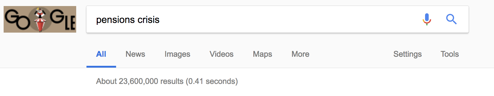
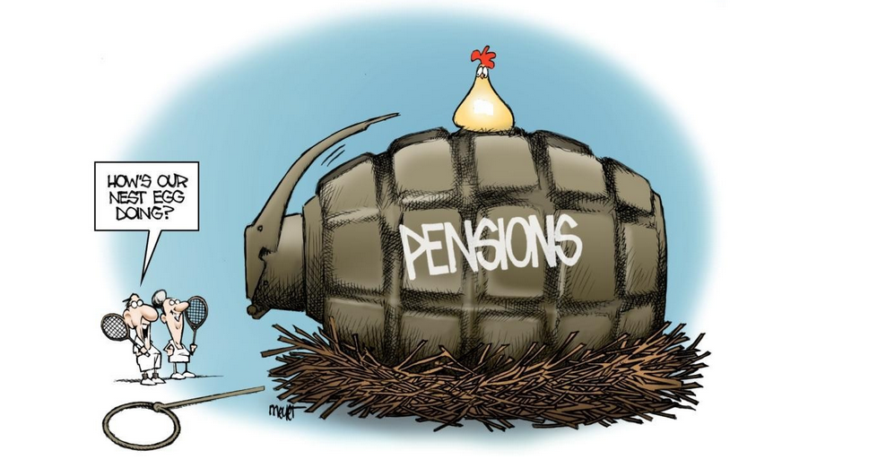

# September 2018 Update

## Token Sale Status

In view of the current market situation, it became apparent that running a public token sale will not prove efficient.  The expenses for allocation of resources for the organisation and handling the campaign would greatly outweigh its outcome, both in terms of time and funds. That’s why we are now preparing a plan for a token distribution alternative, as well as the strategy for marketing and community development until the end of the year.

#### **Early contributor terms**

We realise the longer lead time to the token generation event, and we wanted to acknowledge the support of early contributors. We are in discussions with some of you to explore the optimal way of adjusting the terms that would present a balanced solution for **all** parties. Our findings will be shared in our next update and we welcome considered feedback. 

## Product Development

Let's  recap our main milestones achieved over the last few months:

* Alpha v1.0 has been launched on Kovan testnet in April and is available in our Github**.** 
  * Our team is grateful to have received glowing code reviews from independent reviewers.
* Alpha v1.1 has been launched on Kovan testnet in June and is available on our Github ****with a detailed description [here.](https://medium.com/akropolis/akropolis-mvu-v1-0-e567b81ac332)
  * We designed and ran an [innovative community engagement programme](https://medium.com/akropolis/akropolis-concludes-first-ever-community-quest-5c1e05849a29), which resulted in Akropolis reaching a top-ranked listing in terms of authentic community activity and produced invaluable user-generated input and 200-strong community of engaged beta-testers. We have shared some our findings on our Medium blog**.**
  * This number is worth bearing in mind in the context of most leading Ethereum projects to date have ca.[100s daily active users \(DAUs\)](https://www.stateofthedapps.com/rankings)
  * This has confirmed our belief that people are hungry for a solution to this massive impending problem and are emotionally engaged in wanting to bring about a solution. 
  * We listened to our testers and their stories and are incorporating their preferences into our next product iteration.

Product development schedule going forward:

* Protocol-level rules and interactions have been and remain the focus of our work. This intellectually intensive heavily detail-oriented work is not something that can be easily demonstrated using a pretty picture or made into an exciting readable post. 
* However, bearing in mind the need to let the users have a way of interacting with our protocol, we decided to expand our initial MVP specification and super-charged our UX/UI efforts. 
* MVP v1.0 is scheduled for end September release, with a 2-week testing period scheduled for our engineering team to conduct an internal code review. 
* We are currently in the UX/UI development phase and are gathering feedback from our community and subject matter experts \(SMEs\). 
* In order to expand our beta-tester community, we will be rolling out an MVP initiative with our early backer and strategic partner, [Cindicator](https://cindicator.com/). Their global and active 100,000+ strong community of crypto investors and analysts will be dissecting and analysing our MVP whilst we gather valuable datapoints.

A detailed MVP product update and a revised roadmap will be released later this week. 

## Partnerships and Trial Clients

Crypto ecosystem has sadly become notorious for the lack of real world connection and engagement. Blockchain is a young technology and much of the irrational exuberance has now turned into a more sombre assessment of what value is actually being created outside of the speculative returns of the 2017 ICO era. Our focus has been on real-world partnerships. 

Again, a quick re-cap of our progress of the last few months:

* A trial client signed: an agreement signed with a leading Asian pensions sector asset management firm, which manages the assets of 6 leading global pension funds. Read more about it [**here**](https://medium.com/akropolis/akropolis-tge-update-a44fe1395ae4)**.** 
* Our teams are scheduling a workshop to define the statement of work for the initial trial. 
* The objective is to collaborate with our trial clients to arrive at a generalised and scaleable practical implementation framework that can be offered to a wider institutional community. 
* We expect findings from the above to feed into out open-source product development.

Moving forward, we have more exciting news in the works:

* Technical partnership with a leading Asian blockchain company
* MoU with a leading online pensions platform with over US$500mn AuM to explore product and marketing collaboration, specifically blockchain application for the creation of enhanced platform and financial products
* Partnership discussions with a major academic institution and the Blockchain and Big Data Research Centre to support our R&D initiatives in relation to decentralised finance frameworks. 

## Team

Our engineering team has expanded with the addition of Ben, a full-stack engineer with solid experience in financial sector and two years blockchain and machine learning experience. Ben has worked for UBS, Carlyle, and [Betterment](https://www.betterment.com/), a US$14.5 billion in Assets under Management \(AuM\) wealth management technology firm, where he focussed specifically on their 401\(k\) pensions product. 

Our team of active advisors has been enriched by contributions from Jeffrey, a senior engineer leading a number of blockchain and financial infrastructure initiatives within [Canada Pension Plan Investment Board \(CPPIB\)](http://www.cppib.com/en/), one of the most influential global pension funds with ca.US$367 billion AuM.

We have extended our engineering team with new additions, that shall be announced in due course after the trial periods have been successfully completed. 

## Community Development and Events

### Community Quest

Community quest covered in our [earlier blog post](https://medium.com/akropolis/akropolis-concludes-first-ever-community-quest-5c1e05849a29) has produced some surprisingly positive results. We pride ourselves on being one of the first to have started this kind of marketing activity in crypto space, and, to be honest we didn’t expect such a massive response from the community that has just started to take shape. The tricky thing right now is that organic user engagement is a rare find, and we were slightly skeptical about driving the community at the point where the market is stagnating and there is very little genuine activity in most chatrooms: 

> It’s been a lot of fun and I could feel the efforts of the team. Of my year long experience in crypto there are mainly 2 events that stand out. One is the Mainframe real life airdrop, something new and unique. The second one is this one, an interactive IRL event. I read, I wrote, I understood how Akropolis works during the week long quest. Definitely miles ahead of any other PoC event in any other project. I postponed plans, I missed sleep, and my heartbeat rose to running levels while trying to find the answers. Overall, congratulations to the whole team and very much looking forward to what’s next.

### Events

Our team will be attending and participating in the following events: 

* [Berlin Blockchain week](https://blockchainweek.berlin/): September 5-11 
* [ETHBerlin](https://ethberlin.com/): September 7-9
* [Web3Summit](https://web3summit.com/): October 22-24
* [DevCon](https://devcon4.ethereum.org/): October 30 - 2 November

## Media Coverage

Rachel Wolfson of Forbes has recently profiled us in [Forbes](https://www.forbes.com/sites/rachelwolfson/2018/08/17/former-lehman-brothers-investor-believes-blockchain-technology-can-fix-broken-pension-system/#58603e706bd4). The problem that we are addressing and our mission has resonated with a number of journalists and leading media figures, so expect to see wider organic coverage in the coming months. This builds on the earlier coverage in CNBC and other leading media.

## Thank yous

We are grateful for the ongoing support of the project extended to us formally and informally, and are grateful to be able to attract high quality contributors that are aligned with our mission of creating an alternative pensions and savings protocol that renders multi-billion pension raids impossible, empowers the individuals with control over their assets and opens up new innovative ways to provide future security in the scenarios where most public and private pensions are set to fail in multiple countries across the globe. We leave you with two compelling images of the day:

  

